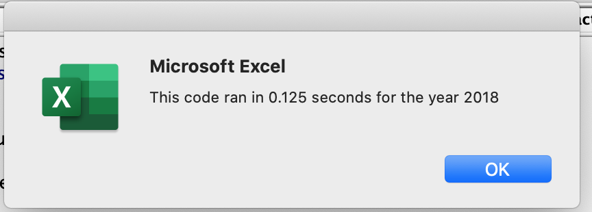

#  Refactor VBA Code and Measure Performance 
Refactoring VBA code for *All stock analysis*

## Overview of Project
---
Finding Yearly Return for `All Stocks` in `2017` and in `2018`

## Results
---
- For the year `2017` TERP has negative Return of 7.2%
</img>

- For the year `2018` ENPH and RUN has the Return value increased by 81.9% and 84.0% respectively 
</img>

## Summary
---
1. What are the advantages or disadvantages of refactoring code?
### *Advantages*
- Helps in executing the program faster 
- We are using arrays, which are more efficient as compare to variables
- Arrays declare a space at one go whereas, variables create a space for every variable

### *Disadvatages*
- Time consuming
- New bugs can arise 

2. How do these pros and cons apply to refactoring the original VBA script?

### *Pros*
- Executed script faster
- Used arrays, and they are more efficient as compare to variables
- Easier to understand the code

### *Cons*
- New Bugs